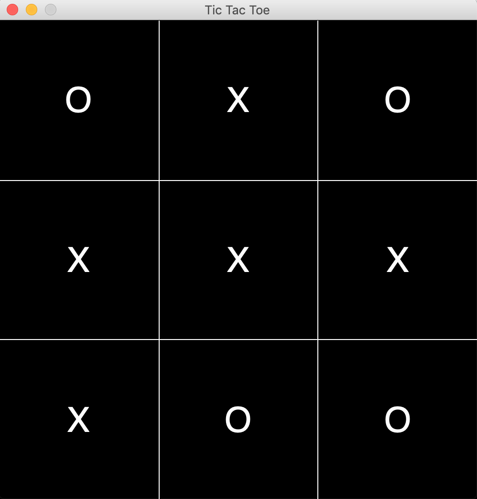

# TicTacToe

## basic GUI-based tic tac toe game 

* version 1.5 features
  * full-functioning two-player game
  * mouse support, clicks on visual board are translated to indices on the logic board (numpy array)
  * scalable to fit any size, 3 x 3 default, 4 x 4, etc
  * replayable
  * losing player starts each subsequent match
  
* upcoming features
  * computer logic to provide a single-player experience
  * ability to draw your symbol on the mousepad (recognition software turning it into standardized characters)
  * window resizing, requires modifications to graphics.py package
  
> preliminary design

